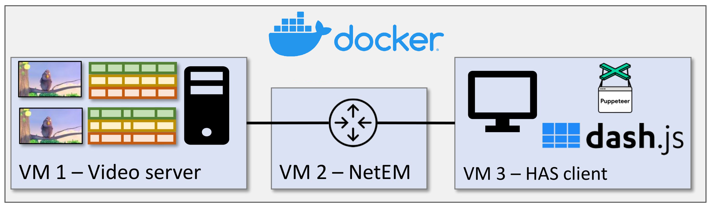

## Testbed DASH Encoding at Runtime

This is a testbed to run and monitor Dynamic Adaptive Streaming over HTTP (DASH) on custom network conditions using
tools such as docker, dash.js, node.js, bash and FFmpeg. 
In addition, a custom Adaptive Bitrate (ABR) Algorithm `(customBufferRule.js) ` for the DASH.js player was implemented,
which was developed with mobile networks (frequent and large network throughput changes) in mind.

### Structure

The setup consists of three containers:

* The server container (`server/`) hosts the video files for streaming and carries out the encoding at runtime, if
  necessary.
* The client container (`client/`)uses dash.js to play the video.
* A network container (`netem/`) regulates the throughput between the server and client.

